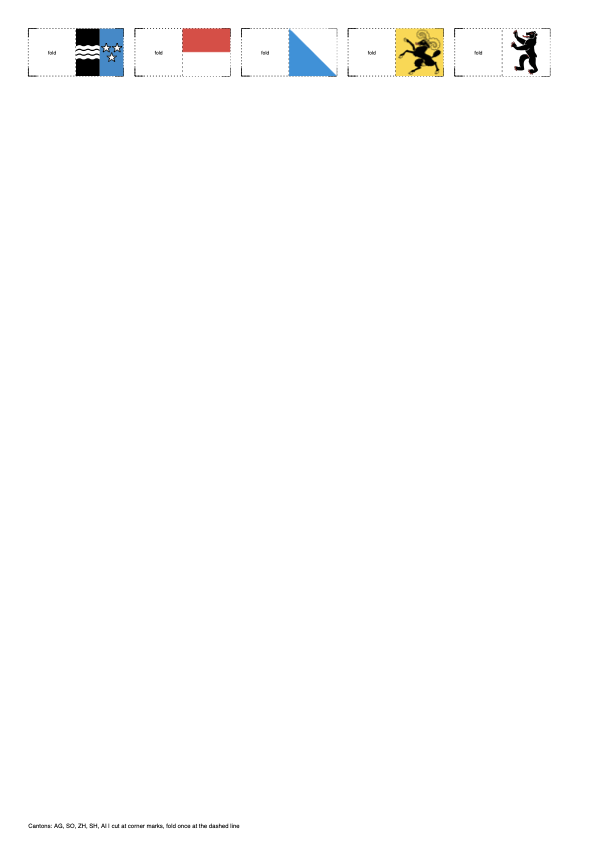

# Swiss Canton Kanton-Skewers Toolkit

Generate printable landscape A4 label strips for skewers using Swiss canton crests or flags.

## Features

- Single CLI application
- Download all canton crest assets
- Download all canton flag assets
- Generate one PDF for one or many cantons
- Generate multiple scale variants and merge into one PDF
- One-class-per-file architecture in `kanton_skewers_app/`

## Asset Folder Convention

Assets are stored in one folder:

- `assets/AG_crest.svg`
- `assets/AG_flag.png`

The generator supports both motif modes:

- `crest` for centered crest rendering
- `flag` for full-area flag rendering

## Installation

```bash
python -m venv .venv
source .venv/bin/activate
pip install -e .
```

Primary command:

```bash
kanton-skewers --help
```

## Quick Start

Download crest assets:

```bash
kanton-skewers download-crests
```

Download flag assets:

```bash
kanton-skewers download-flags
```

If Wikimedia is rate limiting heavily, use slower pacing:

```bash
kanton-skewers download-flags --safe-rate-limit
```

Generate labels:

```bash
kanton-skewers generate AG SO ZH SH AI --motif-mode crest
```

Fold tab width is automatically matched to the cover panel width.

Text labels (canton code/name) are always disabled in generated strips.

Cover layout and fit options:

```bash
kanton-skewers generate AG SO ZH SH AI \
  --motif-mode flag \
  --flag-layout square \
  --flag-fit cover
```

`--flag-layout square` applies to both `--motif-mode flag` and `--motif-mode crest`.

Generate merged variants:

```bash
kanton-skewers generate-variants AG SO ZH SH AI \
  --motif-mode flag \
  --flag-layout square \
  --flag-fit cover \
  --scales 1,1.5,2,2.5,3,3.5,4,4.5,5,5.5 \
  --merged-out kanton_skewers_variants_merged.pdf
```

Note: scales that cannot fit on A4 are skipped automatically.

## Screenshots



